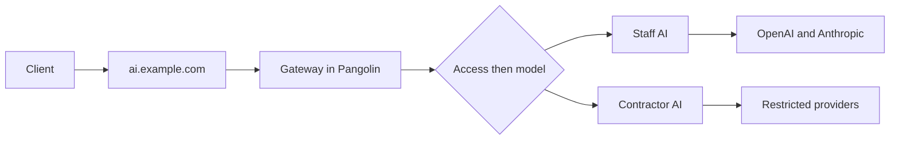

You can create more than one [public](/manage/resources/public/ai-gateway) or [private](/manage/resources/private/ai-gateway) AI Gateway resource. Each one has its own users and roles, attached [providers](/manage/ai/providers/overview), model lists, and [budgets](/manage/ai/budgets). That is how the Employees role gets OpenAI and Anthropic while Contractors get a tighter set, without sharing one allow list.

This is Pangolin's existing access control, applied to AI. A gateway resource is still a resource: you assign [users and roles](/manage/access-control/create-user) to it the same way as [public HTTPS](/manage/resources/public/authentication) or a [private host](/manage/resources/private/authentication). Assign a role when a set of people should share access. Assign individual users when the set is smaller or does not match a role. What differs per resource is which providers, models, and budgets it exposes.

## Users and Roles

Create a resource for the people who should share providers. Assign those users, or a role they belong to, then give the resource its own hostname. Clients point at a URL that already means that resource's providers.

For example:

- Resource **Staff AI**: FQDN `ai-staff.example.com`, role Employees, providers OpenAI and Anthropic.
- Resource **Contractor AI**: FQDN `ai-contractors.example.com`, role Contractors, OpenRouter (or a custom endpoint) with a narrower allow list.

Staff point Claude Code, Codex, or another client at `https://ai-staff.example.com`. Contractors use `https://ai-contractors.example.com`. An [identity key](/manage/ai/virtual-api-keys) is still per user; the hostname is what selects the resource.

The same pattern works across public and private: a public resource for agents on the internet, a private resource for people on the Pangolin client.

## Sharing a Hostname

HTTP and HTTPS resources each need their own fully qualified domain name, because Pangolin would otherwise not know which target to send traffic to. AI Gateway resources can share a FQDN. Every one of them routes to the gateway running inside Pangolin, so they always go to the same place.

The hostname is an entrypoint, not a unique backend. Use a shared name when you want the same split as [users and roles](#users-and-roles), but everyone configures one URL.

You can overlap:

- Several public AI Gateway resources
- Several private AI Gateway resources
- Public and private together

An [HTTP / HTTPS](/manage/resources/public/http-https) resource still cannot use that same name.

### How Pangolin Picks a Resource

On each request, Pangolin lists the enabled AI Gateway resources whose FQDN matches the host, then keeps the ones the caller is allowed to use.

- **Public.** [Users and roles](/manage/resources/public/authentication) on the resource control an [identity key](/manage/ai/virtual-api-keys). A [manual key](/manage/ai/virtual-api-keys#manual-keys) must be scoped to that resource, or to all resources.
- **Private.** [Users, roles, or machines](/manage/resources/private/authentication) granted on the resource, using the connected Pangolin client.

A user or role can be granted on more than one resource in the overlapping set. After access filtering, Pangolin picks among the remaining resources the same way it picks a [provider](/manage/ai/providers/model-routing#provider-selection) on a single resource:

1. **Capability.** The path must match a capability an attached provider advertises.
2. **Allow and block.** The requested model must pass the resource's effective lists.
3. **Specificity, catalog ownership, and class.** Exact allow keys beat patterns. A typed catalog owner beats an aggregator. Native typed providers beat aggregators, which beat Custom.

The chosen resource's attached providers, model lists, and resource-scoped budgets apply. Someone granted on both Staff AI and Contractor AI, both at `ai.example.com`, is routed by the model and API they called.

If more than one resource still matches after those steps, the gateway returns the same ambiguous error as overlapping providers: `Model "<id>" is ambiguous across multiple AI providers on this resource`.

When a public resource and a private resource share a host, calls from the internet use the public path (virtual API key). Calls over the Pangolin client tunnel use the private path (client identity).

The steps above assume [users and roles](/manage/resources/public/authentication) decide who can use each overlapping resource, together with virtual API keys or the connected client. If you also add [access rules](/manage/access-control/rules) (IP, path, geolocation, and similar) on those resources, which overlapping resource a request lands on is undefined. Put access rules on resources that have their own hostname.

