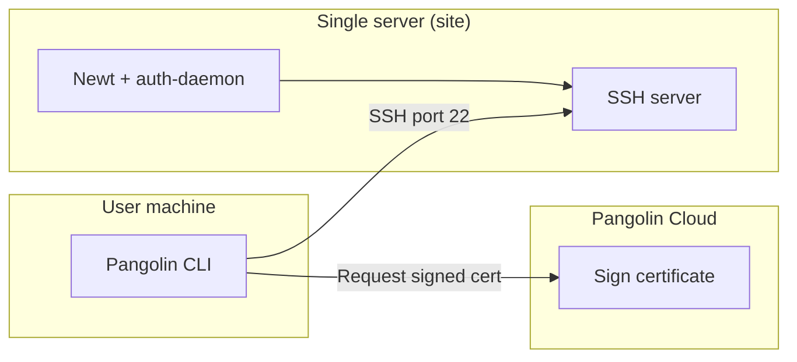
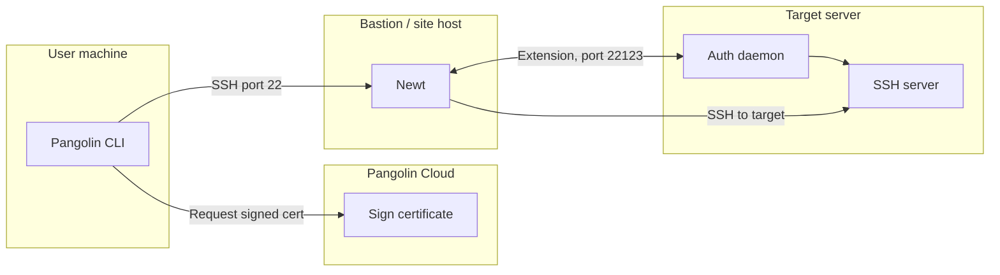

import PangolinCloudTocCta from "/snippets/pangolin-cloud-toc-cta.mdx";

<PangolinCloudTocCta />

<Note>
Only available in [Pangolin Cloud](https://app.pangolin.net/auth/signup) and [Enterprise Edition](/self-host/enterprise-edition).
</Note>

## Overview

Pangolin includes a built-in SSH client so you can connect to remote servers and manage them directly from the terminal. You use your existing Pangolin identity—no separate SSH keys to create or copy. Pangolin generates and signs temporary access keys, pushes them to the remote server, and creates or updates your user account there. All of this happens automatically when you start a connection.

You can SSH into any Pangolin site or private resource. Two components handle SSH on the server side:

<CardGroup cols={2}>
  <Card title="Newt (site connector)" icon="plug" href="#option-1-newt-as-the-auth-daemon-same-host">
    Runs as a daemon and handles SSH for the host it runs on. Use this when the machine you want to SSH into is the same server running Newt.
  </Card>
  <Card title="Auth daemon" icon="server" href="#option-2-external-auth-daemon-ssh-on-another-server-that-doesn%E2%80%99t-run-newt">
    Handles SSH for other servers on the same network. Run the auth daemon on each target host; Newt on a bastion proxies connections to them.
  </Card>
</CardGroup>

You connect using the Pangolin CLI as the SSH client. The tunnel can be provided by the CLI or by another Pangolin client (e.g. the macOS app); you can run the GUI for the tunnel and use the CLI only for SSH if you prefer.

## Quick start: connecting via SSH

From a machine where the Pangolin tunnel is already running (CLI or another client), run:

```bash
pangolin ssh vm-01.prod.example.com
```

Here, `vm-01.prod.example.com` is the **internal alias** of the Pangolin resource (the host you want to SSH into). Pangolin uses your identity to obtain a short-lived certificate and establish the SSH session.

You can also use the resource identifier instead of the alias:

```bash
pangolin ssh elaborate-western-whiptail
```

## How certificates work

Each organization has a **certificate authority (CA)** used to sign temporary SSH keys.

1. When you run `pangolin ssh <alias>`, the Pangolin client generates a temporary key pair.
2. It sends the public key to the Pangolin server with your identity and the target resource.
3. The server checks that you are allowed to access that resource, then signs the public key with the organization CA and returns it. The CA public key is also sent to the remote server and trusted there.
4. The client connects to the remote host using the temporary private key. The host verifies the certificate with the CA and uses principals in the certificate for access control.

This gives short-lived, auditable access without long-lived keys on the server.

## How users and access are managed

Users are provisioned **just in time** on the remote system. When you connect, Pangolin ensures an account exists for you with the right permissions before the SSH session starts. Your Pangolin identity is mapped to a local username (derived from the part before `@` in your identity; if needed, a suffix is added for uniqueness). The account is created with a home directory and can be granted sudo access as configured.

## Setup: choose your architecture

You can enable SSH in two ways:

| Scenario | Approach |
|----------|----------|
| SSH into the **same server** that runs Newt | **Option 1**: Run Newt with auth-daemon support (built-in). |
| SSH into **other servers** on the same network as Newt | **Option 2**: Run Newt on one host (e.g. bastion) and run the auth daemon on each server you want to SSH into. |

<Note>
A single Newt instance cannot run as the auth daemon for its own host **and** use external auth daemons. You must choose one mode: either Option 1 (built-in auth daemon on this host) or Option 2 (external auth daemons on other hosts).
</Note>

Both options require the SSH server on each target host to be configured to trust the Pangolin CA and to use the auth daemon for principals (see [Configure the SSH server](#configure-the-ssh-server-on-the-host) below). You also need a **private resource** on the site for each host you want to SSH into (see below).

## Create a private resource (required)

SSH access in both Option 1 and Option 2 is scoped to a private resource. You must create a private resource on the site for the host (or each host) you want to SSH into, then grant access and allow TCP 22.

1. **Create a private resource** on the site in the Pangolin dashboard. The resource should target the host that will run Newt (Option 1) or the host that will run the auth daemon (Option 2). Give it a destination (IP or FQDN of the server). You can use an [alias](/manage/resources/private/alias) (e.g. `vm-01.prod.example.com`) so users connect with a friendly name: `pangolin ssh vm-01.prod.example.com`.

2. **Grant access** to the resource by assigning **users** or **roles** in the resource’s access settings. Only users or roles with access can obtain SSH certificates and connect.

3. **Allow TCP 22 in port restrictions.** In the private resource’s port restrictions, ensure **TCP 22** is allowed so SSH traffic is permitted through the tunnel. Without this, SSH connections to the resource will be blocked.

<Warning>
If TCP 22 is not allowed in the resource’s port restrictions, users will not be able to establish SSH sessions to that resource even when the rest of the setup is correct.
</Warning>

After the resource exists and access is granted, proceed with [Option 1](#option-1-newt-as-the-auth-daemon-same-host) or [Option 2](#option-2-external-auth-daemon-different-servers) below.

## Option 1: Newt as the auth daemon (same host)

Use this when the machine you want to SSH into **is** the machine running Newt (e.g. the site connector and SSH are on the same server).



### Run Newt with auth-daemon enabled

With Newt [installed](/manage/sites/install-site), run it in auth-daemon mode so it can handle SSH on this host:

```bash
sudo newt --id <id> --secret <secret> --endpoint <endpoint> --auth-daemon
```

<Note>
Replace `<id>`, `<secret>`, and `<endpoint>` with the values from your site configuration in the Pangolin dashboard.
</Note>

Then configure the SSH server on this host as described in [Configure the SSH server on the host](#configure-the-ssh-server-on-the-host).

## Option 2: External auth daemon (SSH on another server that doesn't run Newt)

Use this when you want to SSH into servers that **do not** run Newt. One host runs Newt (e.g. as a bastion); each target server runs the Pangolin auth daemon as an extension of Newt. The client connects to the target by going **through** Newt—Newt proxies the SSH connection to the auth daemon and SSH server on each target.



### Prerequisites

- **Newt** running on one host (the “site” / bastion) with auth-daemon support and a pre-shared key for external auth daemons.
- **Pangolin CLI** installed on each server where you will run the auth daemon. See [Install Clients — Quick Install (Recommended)](/manage/clients/install-client#quick-install-recommended).

### Step 1: On the server running Newt

Start Newt with a **pre-shared key** so external auth daemons can authenticate to it:

```bash
sudo newt --id <id> --secret <secret> --endpoint <endpoint> --ad-pre-shared-key <pre-shared-key>
```

<Note>
Choose a strong, random value for `<pre-shared-key>` and use the same value when starting the auth daemon on each target server.
</Note>

### Step 2: On each server you want to SSH into

On every host that should accept Pangolin SSH (and is not running Newt), run the auth daemon with the same pre-shared key:

```bash
sudo pangolin auth-daemon --pre-shared-key <pre-shared-key>
```

To use a non-default port, add `--port <port>` and set the same port in the resource’s SSH settings in the dashboard.

#### Run as a systemd service

Create a systemd unit so the auth daemon runs on boot:

```ini title="/etc/systemd/system/pangolin-auth-daemon.service"
[Unit]
Description=Pangolin SSH auth daemon
After=network.target

[Service]
ExecStart=/usr/local/bin/pangolin auth-daemon --pre-shared-key <pre-shared-key>
Restart=always
User=root

[Install]
WantedBy=multi-user.target
```

Replace `<pre-shared-key>` with the same value used on Newt. If you use a custom port (set in the resource’s SSH settings), add `--port <port>` to `ExecStart`. Then:

```bash
sudo systemctl daemon-reload
sudo systemctl enable pangolin-auth-daemon
sudo systemctl start pangolin-auth-daemon
sudo systemctl status pangolin-auth-daemon
```

<Warning>
Ensure the Pangolin CLI binary is at `/usr/local/bin/pangolin` (or update `ExecStart` to its path) before creating the service.
</Warning>

### Step 3: Configure the SSH server on each target host

On each of these hosts, configure the SSH server as in [Configure the SSH server on the host](#configure-the-ssh-server-on-the-host). Use the `pangolin auth-daemon principals` command in `AuthorizedPrincipalsCommand` (see that section for the exact line).

### Step 4: Ensure network connectivity

- **Newt → auth daemon:** Newt must be able to reach the auth daemon port on each target server (default **TCP 22123**; configurable in the resource’s SSH settings and via the auth daemon’s `--port` flag).
- **Clients → SSH:** Port **22** must be open for SSH to each target server (from wherever your users connect—often only within your private network).

<Note>
To change the auth daemon port from the default 22123, configure the port in the resource’s SSH settings in Pangolin and pass the same port with `--port` when starting the auth daemon.
</Note>

<Warning>
These ports do not need to be exposed to the public internet. They only need to be reachable within the network where Newt and the target servers live.
</Warning>

## Configure the SSH server on the host

For both Option 1 and Option 2, the host’s SSH server must trust the Pangolin CA and use the auth daemon to resolve principals. Do the following on **every** host that will accept Pangolin SSH (the host running Newt in Option 1, or each host running the external auth daemon in Option 2).

### 1. Update `sshd_config`

Add or adjust these lines in `/etc/ssh/sshd_config`:

- **Option 1 (Newt on this host):** use `newt auth-daemon principals` in the command.
- **Option 2 (external auth daemon on this host):** use `pangolin auth-daemon principals` in the command.

Example for **Option 1** (Newt on same host):

```ini title="/etc/ssh/sshd_config"
TrustedUserCAKeys /etc/ssh/ca.pem
AuthorizedPrincipalsCommand /usr/local/bin/newt auth-daemon principals --username %u
AuthorizedPrincipalsCommandUser root
```

Example for **Option 2** (external auth daemon on this host):

```ini title="/etc/ssh/sshd_config"
TrustedUserCAKeys /etc/ssh/ca.pem
AuthorizedPrincipalsCommand /usr/local/bin/pangolin auth-daemon principals --username %u
AuthorizedPrincipalsCommandUser root
```

### 2. Restart the SSH server

```bash
sudo systemctl restart ssh
```

After this, users with access to the resource in Pangolin can run `pangolin ssh <alias>` to connect.

## Signing keys for other applications

You can ask Pangolin to sign a key for a resource without starting an interactive SSH session. Useful for scripts or tools that use SSH with a specific key:

```bash
pangolin ssh sign vm-01.prod.example.com --key-file /path/to/public/key.pub
```

## Generating passwords for users

If you need a password to be generated for your user on the remote system (e.g. for sudo access or if you have passwords required in your sshd config), you can use:

`--generate-random-password` to have Pangolin generate a random password when users are created on the device

```bash

## FAQ

### How long are the temporary keys valid?

When the client requests a signed key from the Pangolin server, the certificate is valid for **5 minutes**. You must start the SSH connection within that window. Once the session is established, it can stay open; the certificate is only needed for the initial authentication.

### Is the SSH connection proxied through Newt?

**Option 1 (same host):** No. Your client connects directly to the server that runs Newt; SSH traffic does not go through another hop.

**Option 2 (external auth daemon):** Yes. Your client connects to Newt, and Newt proxies the SSH session to the target server. The auth daemon on each target is an extension of Newt and works with it to complete the connection.

### How are usernames created on the remote server?

Pangolin derives the remote username from your Pangolin identity (the part before `@`). If that name is already taken in the organization, a numeric suffix is added until it is unique. The user is created with a home directory and can be added to sudoers as configured by your organization.

### How does Newt communicate with the external auth daemon?

Newt talks to the auth daemon over **HTTPS**. **TCP 22123** is used by default. When you SSH into a server that uses the external auth daemon, Newt calls the auth daemon on that host to create or update your user and resolve principals. Port 22123 only needs to be open between Newt and the auth daemon hosts on your internal network; it should not be exposed to the internet.

To use a different port, set the port in the resource’s SSH settings in the Pangolin dashboard and pass the same port to the auth daemon with the `--port` flag (e.g. `pangolin auth-daemon --pre-shared-key <key> --port 22124`). Newt and the auth daemon must use the same port.
