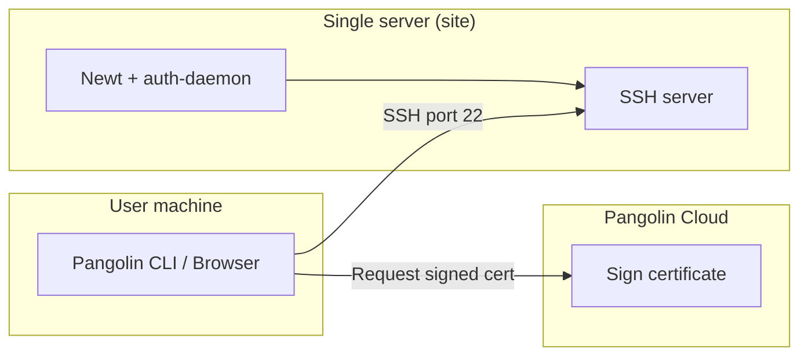
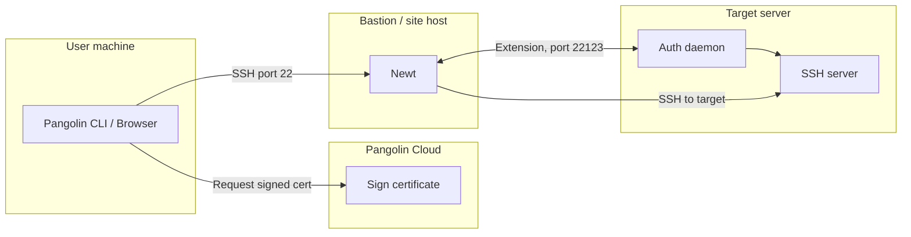

import PangolinCloudTocCta from "/snippets/pangolin-cloud-toc-cta.mdx";

{/* <iframe
  className="w-full aspect-video rounded-xl"
  src="https://www.youtube.com/embed/U4O9pESwMEg"
  title="Pangolin SSH Access walkthrough"
  frameBorder="0"
  allow="accelerometer; autoplay; clipboard-write; encrypted-media; gyroscope; picture-in-picture"
  allowFullScreen
></iframe> */}

<PangolinCloudTocCta />

<Note>
Only available in [Pangolin Cloud](https://app.pangolin.net/auth/signup) and [Enterprise Edition](/self-host/enterprise-edition).
</Note>

Pangolin SSH works on both [public](/manage/resources/public/ssh) and [private](/manage/resources/private/ssh) resources. The SSH configuration in the dashboard is identical for both—the difference is how users connect (browser vs. `pangolin ssh`) and which authentication layer gates access first.

This page explains the configuration options shared by both resource types, gives a concrete example for every valid combination, and walks through host setup for **Standard SSH Server** automated provisioning.

## Default Configuration (Easiest)

When you create an SSH resource, the dashboard defaults to **Pangolin SSH** mode with **Manual Authentication**. This is the easiest path—it works out of the box with no auth daemon, no OpenSSH reconfiguration, and no extra host setup beyond running Newt as root.

With these defaults:

1. Create the SSH resource and select a site where Newt runs as root on the machine you want to access.
2. Leave mode as **Pangolin SSH** and authentication as **Manual Authentication**.
3. Users connect and authenticate with credentials that already exist on that host.

On a [public resource](/manage/resources/public/ssh), users visit the resource FQDN, complete Pangolin authentication, then enter their host username and password (or private key) in the browser form. On a [private resource](/manage/resources/private/ssh), users connect with the Pangolin client and run `pangolin ssh username@<alias>`—Pangolin prompts for the host password. To use a private key instead, pass it with `-i`: `pangolin ssh username@<alias> -i <key-file>`.

That is the entire setup for the default preset. If you need Pangolin identities provisioned automatically on the host—without password prompts—switch to **Automated Provisioning**. With **Pangolin SSH** mode, that also works without OpenSSH or auth daemon configuration—Newt still must run as root. With **Standard SSH Server** mode, follow the host setup sections below.

## Configuration Options

SSH resources are configured through three decisions in the dashboard.

### Mode

| Option | Description |
|--------|-------------|
| **Pangolin SSH (Recommended)** | Executes commands directly on the host via the site connector. No network SSH server is required, and you do not enter a host or port. Newt must run as the [binary](/manage/sites/install-site#binary-installation) on the host as root (`sudo newt ...`). Containerized installs are not supported—sessions may open the container shell instead of the host. |
| **Standard SSH Server** | Routes commands over the network to an SSH server such as OpenSSH. Enter the backend host and port. To use automated provisioning (PAM) with this mode, you must configure OpenSSH to accept Pangolin certificates and connections. This mode also supports a remote auth daemon for pushing users to machines on the same network as the site connector that are not running the connector itself. |

<Warning>
**Pangolin SSH mode requires the Newt binary on the host.** Install Newt as a [binary on the site connector host](/manage/sites/install-site#binary-installation) and run it as root (`sudo newt ...` or a root systemd service). If Newt runs in a container, SSH sessions may drop you into the container shell rather than the host.
</Warning>

### Authentication Method

| Option | Description |
|--------|-------------|
| **Manual Authentication** | Requires existing host credentials and bypasses automatic user provisioning. On [public resources](/manage/resources/public/ssh), users enter a username and password or upload a private key in a browser form after completing the public authentication layer. On [private resources](/manage/resources/private/ssh), credentials are handled by the SSH client. |
| **Automated Provisioning** | Automatically creates users, groups, and sudo permissions on the host based on Pangolin identity (PAM). Requires auth daemon and OpenSSH configuration on the target host. |

### Auth Daemon Location

Only shown when **Automated Provisioning** is selected.

| Option | Description |
|--------|-------------|
| **On Site** | The auth daemon runs on the machine hosting the site connector. Use when the connector and target SSH host are the same machine, or when the connector handles provisioning locally. |
| **On Remote Host** | The auth daemon runs on a separate target machine on the same network. Use when the site connector is a bastion and each target host runs its own auth daemon. Only applies with **Standard SSH Server** mode. |

### Daemon Port

When the auth daemon runs on a remote host, set the port it listens on (default `22123`). This must match the `--port` flag used when starting the auth daemon. Newt and the auth daemon communicate over HTTPS on this port within your internal network.

<Warning>
Ensure your target host is properly configured to run the auth daemon before completing setup, or provisioning will fail.
</Warning>

## Configuration Examples

There are five valid configuration combinations. Auth daemon location is not applicable when using manual authentication.

### 1. Pangolin SSH + Manual Authentication

**Settings:** Mode = Pangolin SSH · Authentication = Manual

**When to use:** You want the simplest setup. The site connector runs on the machine you need to access, and users already have local accounts with passwords or keys on that host.

**Example:** A small team exposes a staging server that runs Newt. You create a public SSH resource with Pangolin SSH and manual authentication. Developers visit `https://staging-ssh.example.com`, pass Pangolin login, then enter their existing Linux username and password in the browser form. No OpenSSH reconfiguration or auth daemon is needed on the host—run Newt as root.

**Host setup required:** Run Newt as root on the site connector host (`sudo newt ...`).

---

### 2. Pangolin SSH + Automated Provisioning + On Site

**Settings:** Mode = Pangolin SSH · Authentication = Automated Provisioning · Auth Daemon = On Site

**When to use:** The site connector runs on the machine you want to access, and you want Pangolin identities mapped to local users automatically—no password prompts and no separate SSH server routing.

**Example:** Your production app server runs Newt. You create a private SSH resource with an alias `prod-app.internal` and configure Pangolin SSH with automated provisioning on site. Developers connect with the Pangolin client and run `pangolin ssh prod-app.internal`. Pangolin provisions their account on the fly from their organization identity.

**Host setup required:** Run Newt as root on the site connector host. Pangolin SSH handles provisioning through the site connector directly.

---

### 3. Standard SSH Server + Manual Authentication

**Settings:** Mode = Standard SSH Server · Authentication = Manual

**When to use:** You need to reach an existing OpenSSH server on the network and users will authenticate with credentials already configured on that server.

**Example:** A legacy database server at `10.0.5.20` runs standard OpenSSH with per-user keys. You create a public SSH resource pointing at `10.0.5.20:22` with manual authentication. DBAs visit the resource FQDN, complete Pangolin authentication, then upload their private key in the browser form to open a terminal session. If the same host is reachable from multiple site connectors, select all applicable sites—Pangolin routes through the healthiest one automatically.

**Host setup required:** None—use your existing OpenSSH configuration.

---

### 4. Standard SSH Server + Automated Provisioning + On Site

**Settings:** Mode = Standard SSH Server · Authentication = Automated Provisioning · Auth Daemon = On Site

**When to use:** OpenSSH runs on the same machine as the site connector, but you want network SSH routing (Standard SSH Server mode) with Pangolin identity provisioning instead of Pangolin SSH mode.

**Example:** Newt runs on your production app server. OpenSSH also listens on that host. You create a private SSH resource with destination `localhost`, allow TCP 22 in [port restrictions](/manage/resources/private/port-restrictions), and assign an alias such as `prod-app.internal`. Configure Standard SSH Server mode pointing at `127.0.0.1:22`, automated provisioning, and auth daemon on site. Engineers run `pangolin ssh prod-app.internal` and land on the same machine running Newt with a provisioned account.

**Host setup required:** Run Newt and configure OpenSSH on the same host. Newt runs as an auth daemon by default. No extra flag is needed. See [Option 1](#option-1-newt-as-the-auth-daemon-same-host).

---

### 5. Standard SSH Server + Automated Provisioning + On Remote Host

**Settings:** Mode = Standard SSH Server · Authentication = Automated Provisioning · Auth Daemon = On Remote Host

**When to use:** The site connector runs on a bastion, and you need to SSH into multiple other servers on the same network that do not run Newt. This is the most common automated provisioning setup for multi-server environments.

**Example:** Newt runs on `bastion.corp.internal`. You have application servers `app-01` and `app-02` on the same VLAN. For `app-01`, you create a private SSH resource with destination `10.0.5.21` (the IP of the OpenSSH server on the remote host), allow TCP 22 in [port restrictions](/manage/resources/private/port-restrictions), and assign alias `app-01.corp.internal` as the domain name users connect with. Configure Standard SSH Server mode with host `10.0.5.21:22`, automated provisioning, and auth daemon on remote host (daemon port `22123`). Each app server runs `pangolin auth-daemon`. Developers run `pangolin ssh app-01.corp.internal`—the client tunnels through Newt, which proxies SSH to the OpenSSH server and coordinates with the auth daemon on that host to provision the user.

**Host setup required:** Newt on the bastion with a pre-shared key, auth daemon on each target host, OpenSSH configured on each target. See [Option 2: External auth daemon](#option-2-external-auth-daemon-ssh-on-another-server-that-doesnt-run-newt).

---

<Note>
**Pangolin SSH + Automated Provisioning + On Remote Host** is not a valid combination. Pangolin SSH executes sessions on the site connector host itself, so the auth daemon must run on site. Use **Standard SSH Server** mode when the auth daemon runs on a remote host.
</Note>

## How Certificates Work

When using automated provisioning, each organization has a **certificate authority (CA)** used to sign temporary SSH keys. This is only used for automated provisioning on Standard SSH Server mode. Pangolin SSH doesn't use standard SSH certificates and instead uses its own authentication layer.

1. The user initiates a connection (browser for public resources, `pangolin ssh <alias>` for private).
2. Pangolin generates a temporary key pair and sends the public key to the Pangolin server with the user's identity and target resource.
3. The server checks access, signs the public key with the organization CA, and returns it. The CA public key is sent to the remote server and trusted there.
4. The client connects using the temporary private key. The host verifies the certificate with the CA and uses principals in the certificate for access control.

This gives short-lived, auditable access without long-lived keys on the server.

## How Users and Access Are Managed

When using **Standard SSH Server** with automated provisioning, users are provisioned **just in time** on the remote system. When you connect, Pangolin ensures an account exists for you with the right permissions before the SSH session starts. Your Pangolin identity is mapped to a local username (derived from the part before `@` in your identity; if needed, a suffix is added for uniqueness). The account is created with a home directory and can be granted sudo access as configured.

With **Pangolin SSH** and automated provisioning, Pangolin handles user provisioning through the site connector directly—no OpenSSH or auth daemon setup required on the host. Newt must still run as root.

## Host Setup

Host setup is only required for **Standard SSH Server** mode with **Automated Provisioning**. **Pangolin SSH** mode (manual or automated) requires Newt to run as root on the site connector host but does not require OpenSSH or auth daemon configuration.

| Configuration | Setup path |
|---------------|------------|
| Standard SSH Server + Automated + On Site | [Option 1](#option-1-newt-as-the-auth-daemon-same-host) |
| Standard SSH Server + Automated + On Remote Host | [Option 2](#option-2-external-auth-daemon-ssh-on-another-server-that-doesnt-run-newt) |

Before setting up the host, create the SSH resource (public or private) in the dashboard, grant access, and for private resources allow TCP 22 in [port restrictions](/manage/resources/private/port-restrictions).

## Option 1: Newt as the auth daemon (same host)

Use this for combination **4**—when the auth daemon runs on the site connector host and you are routing to OpenSSH in Standard SSH Server mode.


```mermaid
flowchart LR
  subgraph client["User machine"]
    CLI[Pangolin CLI / Browser]
  end

  subgraph cloud["Pangolin Cloud"]
    CA[Sign certificate]
  end

  subgraph server["Single server (site)"]
    direction TB
    Newt[Newt + auth-daemon]
    SSHD[SSH server]
    Newt --> SSHD
  end

  CLI -->|Request signed cert| CA
  CLI -->|SSH port 22| SSHD
```

### Run Newt

With Newt [installed](/manage/sites/install-site), run it normally. Newt runs as an auth daemon by default:

```bash
sudo newt --id <id> --secret <secret> --endpoint <endpoint>
```

<Note>
Replace `<id>`, `<secret>`, and `<endpoint>` with the values from your site configuration in the Pangolin dashboard.
</Note>

Then configure the SSH server on this host as described in [Configure the SSH server on the host](#configure-the-ssh-server-on-the-host).

## Option 2: External auth daemon (SSH on another server that doesn't run Newt)

Use this for combination **5**—when the site connector is a bastion and each target host runs its own auth daemon.


```mermaid
flowchart LR
  subgraph client["User machine"]
    CLI[Pangolin CLI / Browser]
  end

  subgraph cloud["Pangolin Cloud"]
    CA[Sign certificate]
  end

  subgraph bastion["Bastion / site host"]
    Newt[Newt]
  end

  subgraph target["Target server"]
    direction TB
    AuthDaemon[Auth daemon]
    SSHD[SSH server]
    AuthDaemon --> SSHD
  end

  CLI -->|Request signed cert| CA
  CLI -->|SSH port 22| Newt
  Newt -->|SSH to target| SSHD
  Newt <-->|Extension, port 22123| AuthDaemon
```

### Prerequisites

- **Newt** running on one host (the site / bastion) with a pre-shared key for external auth daemons.
- **Pangolin CLI** installed on each server where you will run the auth daemon. See [Install Clients — Quick Install (Recommended)](/manage/clients/install-client#quick-install-recommended).

### Step 1: On the server running Newt

Start Newt with a **pre-shared key** so external auth daemons can authenticate to it:

```bash
sudo newt --id <id> --secret <secret> --endpoint <endpoint> --ad-pre-shared-key <pre-shared-key>
```

<Note>
Choose a strong, random value for `<pre-shared-key>` and use the same value when starting the auth daemon on each target server.
</Note>

### Step 2: On each server you want to SSH into

On every host that should accept Pangolin SSH (and is not running Newt), run the auth daemon with the same pre-shared key:

```bash
sudo pangolin auth-daemon --pre-shared-key <pre-shared-key>
```

To use a non-default port, add `--port <port>` and set the same port in the resource's SSH settings in the dashboard.

#### Run as a systemd service

Create a systemd unit so the auth daemon runs on boot:

```ini title="/etc/systemd/system/pangolin-auth-daemon.service"
[Unit]
Description=Pangolin SSH auth daemon
After=network.target

[Service]
ExecStart=/usr/local/bin/pangolin auth-daemon --pre-shared-key <pre-shared-key>
Restart=always
User=root

[Install]
WantedBy=multi-user.target
```

Replace `<pre-shared-key>` with the same value used on Newt. If you use a custom port (set in the resource's SSH settings), add `--port <port>` to `ExecStart`. Then:

```bash
sudo systemctl daemon-reload
sudo systemctl enable pangolin-auth-daemon
sudo systemctl start pangolin-auth-daemon
sudo systemctl status pangolin-auth-daemon
```

<Warning>
Ensure the Pangolin CLI binary is at `/usr/local/bin/pangolin` (or update `ExecStart` to its path) before creating the service.
</Warning>

### Step 3: Configure the SSH server on each target host

On each of these hosts, configure the SSH server as in [Configure the SSH server on the host](#configure-the-ssh-server-on-the-host). Use the `pangolin auth-daemon principals` command in `AuthorizedPrincipalsCommand`.

### Step 4: Ensure network connectivity

- **Newt → auth daemon:** Newt must be able to reach the auth daemon port on each target server (default **TCP 22123**).
- **Clients → SSH:** Port **22** must be open for SSH to each target server.

<Warning>
These ports do not need to be exposed to the public internet. They only need to be reachable within the network where Newt and the target servers live.
</Warning>

## Configure the SSH server on the host

For automated provisioning, the host's SSH server must trust the Pangolin CA and use the auth daemon to resolve principals. Do the following on **every** host that will accept Pangolin SSH.

### 1. Update `sshd_config`

Add or adjust these lines in `/etc/ssh/sshd_config`:

- **Auth daemon on this host (Newt):** use `newt auth-daemon principals` in the command.
- **External auth daemon on this host:** use `pangolin auth-daemon principals` in the command.

Example for **auth daemon on site** (Newt on same host):

```ini title="/etc/ssh/sshd_config"
TrustedUserCAKeys /etc/ssh/ca.pem
AuthorizedPrincipalsCommand /usr/local/bin/newt auth-daemon principals --username %u
AuthorizedPrincipalsCommandUser root
```

Example for **external auth daemon on this host**:

```ini title="/etc/ssh/sshd_config"
TrustedUserCAKeys /etc/ssh/ca.pem
AuthorizedPrincipalsCommand /usr/local/bin/pangolin auth-daemon principals --username %u
AuthorizedPrincipalsCommandUser root
```

### 2. Restart the SSH server

```bash
sudo systemctl restart ssh
```

After this, users with access to the resource can connect via the browser (public) or `pangolin ssh <alias>` (private).

## Signing Keys for Other Applications

You can ask Pangolin to sign a key for a resource without starting an interactive SSH session:

```bash
pangolin ssh sign vm-01.prod.example.com --key-file /path/to/public/key.pub
```

## Generating Passwords for Users

If you need a password generated for your user on the remote system (for example for sudo access), use `--ad-generate-random-password` to have Pangolin generate a random password when users are created on the device.

## FAQ

### How long are the temporary keys valid?

When the client requests a signed key from the Pangolin server, the certificate is valid for **5 minutes**. You must start the SSH connection within that window. Once the session is established, it can stay open.

### Is the SSH connection proxied through Newt?

**Pangolin SSH mode or auth daemon on site:** Your client connects directly to the server that runs Newt; SSH traffic does not go through another hop.

**Standard SSH Server + remote auth daemon:** Your client connects to Newt, and Newt proxies the SSH session to the target server. The auth daemon on each target is an extension of Newt.

### How are usernames created on the remote server?

Pangolin derives the remote username from your Pangolin identity (the part before `@`). If that name is already taken in the organization, a numeric suffix is added until it is unique.

### How does Newt communicate with the external auth daemon?

Newt talks to the auth daemon over **HTTPS** on **TCP 22123** by default. Port 22123 only needs to be open between Newt and the auth daemon hosts on your internal network.

To use a different port, set the port in the resource's SSH settings and pass the same port to the auth daemon with `--port`.
