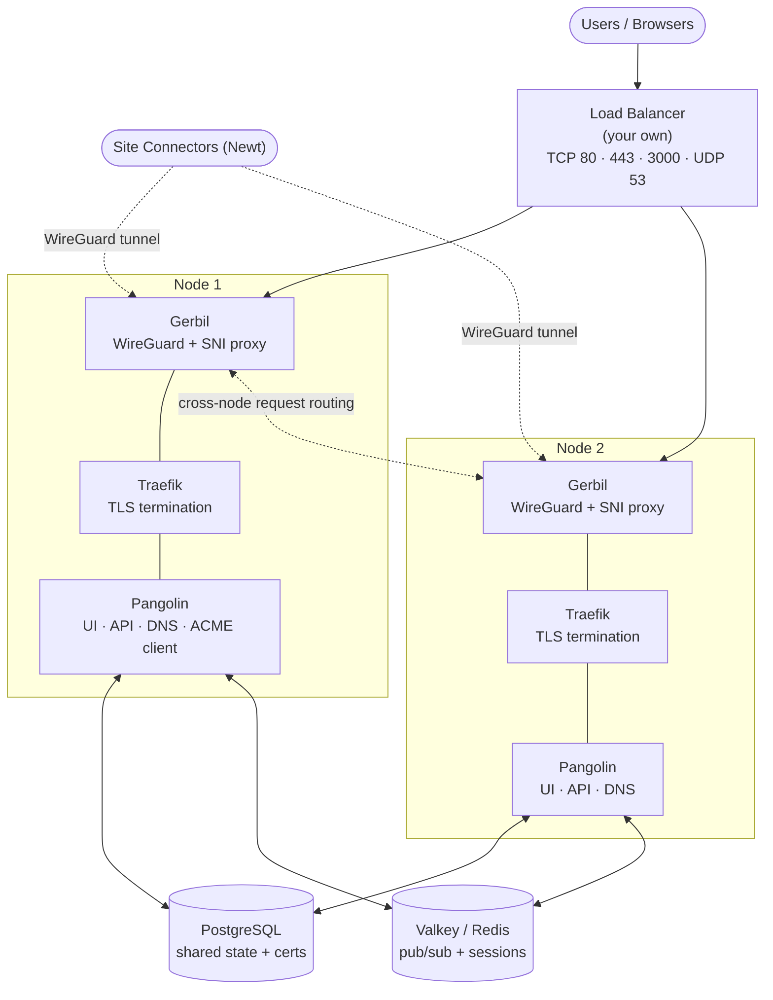

<Note>
Clustering is only available in [Enterprise Edition](/self-host/enterprise-edition).
</Note>

For organizations requiring maximum uptime and performance, Pangolin supports clustered deployments where multiple server instances work together as a unified system. This architecture enables regional distribution, automatic failover, and horizontal scaling to handle demanding production workloads.

In a clustered configuration, multiple Pangolin instances operate together, sharing state through a PostgreSQL database and a Valkey (Redis) server. Each instance independently serves user requests, resolves DNS, manages authentication, and coordinates with its own Gerbil instance to support thousands of sites across your organization.

## Architecture

A Pangolin cluster consists of several coordinated components that work together to provide high availability and seamless failover.

### Pangolin Instances

**Purpose**: Serve the web UI and API, resolve DNS, issue and renew TLS certificates, and coordinate cluster state.

**How It Works**:
- Multiple Pangolin instances run simultaneously across different nodes, one per node
- Each instance can independently handle user authentication and requests
- All instances share state through the PostgreSQL database and Valkey
- Each instance embeds a DNS server used for resource resolution and ACME DNS-01 challenges
- Only one instance in the cluster should be configured as the ACME client. It issues and renews certificates and stores them encrypted in PostgreSQL. Every other instance reads the same certificates from the database

**High Availability**: A load balancer sits in front of all Pangolin instances. If any instance goes down, the load balancer automatically routes traffic to healthy nodes, ensuring the UI, API, and DNS remain accessible from the same domain without interruption.

### PostgreSQL Database

**Purpose**: Store all persistent cluster state in a centralized, shared database.

**How It Works**:
- All Pangolin instances connect to the same shared PostgreSQL database
- Stores user accounts, site configurations, resources, access policies, and organizational settings
- Certificates are stored encrypted in the database for security
- Changes made through any instance are immediately available cluster-wide

**High Availability**: Database replication and backup strategies ensure data persistence and availability across the cluster. See [Database Options](/self-host/advanced/database-options) for general PostgreSQL configuration.

### Valkey (Redis)

**Purpose**: Provide real-time state synchronization between cluster nodes.

**How It Works**:
- Pub/sub messaging handles cross node messaging for websocket command control 
- Handles caching for the cluster 
- Any Redis-compatible server works, as long as it supports pub/sub

**High Availability**: Ensures that session and connection information remains available even when individual nodes fail.

### Traefik Instances

**Purpose**: Route HTTP/HTTPS traffic to resources and terminate TLS connections.

**How It Works**:
- Each cluster node runs its own Traefik instance
- Pangolin writes router configuration and certificates to a shared volume with Traefik (`file_mode`) instead of Traefik scraping the Pangolin API directly, since Traefik can only load certificates from files
- Each node's Pangolin instance pulls the certificate from the database to that shared volume so its local Traefik can read it
- Sits behind Gerbil, which runs an SNI proxy for traffic routing

**High Availability**: Multiple Traefik instances ensure traffic routing continues even if individual nodes fail.

### Gerbil Instances

**Purpose**: Manage WireGuard tunnels to site connectors and route traffic between cluster nodes.

**How It Works**:
- Each Pangolin instance runs alongside its own Gerbil tunnel manager
- Handles WireGuard VPN connections from site connectors (Newt)
- Site connectors can establish tunnels to any available Gerbil instance
- Every Gerbil instance is made aware of the other trusted nodes in the cluster
- When a request lands on the node that isn't holding the relevant tunnel, Gerbil routes it to the correct node instead of dropping it - this covers the case where DNS caching sends a client to the "wrong" node

**High Availability**: Distributed tunnel management ensures connectivity remains available even if individual Gerbil instances fail, with automatic cross-node failover.

### Load Balancer

**Purpose**: Distribute incoming traffic across healthy Pangolin instances.

**How It Works**:
- Sits in front of all cluster nodes, fronting the dashboard/API port, HTTP/HTTPS resource ports, and DNS
- Monitors instance health (the `/ping` endpoint) and routes traffic only to available nodes
- Ensures all traffic reaches the cluster through a single, consistent domain
- Does NOT handle resource routing - these are directed to the correct node directly by the DNS server

**High Availability**: Essential for continuous access to the Pangolin UI, API, and DNS regardless of individual instance failures. **You must provide your own HA load balancer** in front of the cluster - this can be a cloud load balancer or a self-hosted one.

## Traffic Flow

Understanding how requests flow through the cluster helps clarify how these components work together:

1. **User access**: Users access the Pangolin UI/API through the load balancer, which routes to any healthy Pangolin instance
2. **Resource requests**: When accessing a resource, DNS resolves to the node that the site is connected to, and the request is routed to that node's Gerbil instance
3. **Cross-node routing**: If DNS caching or the load balancer points to a node that isn't holding the relevant tunnel, Gerbil routes the request to the correct node
4. **Tunnel routing**: Gerbil receives the request and forwards it to the local Traefik instance
5. **TLS termination**: Traefik terminates TLS using the certificate synced to its shared volume, then proxies the request to the site connector's tunnel

## How Failover Works

When a node fails, the load balancer stops routing to it and traffic continues to flow through the remaining healthy nodes. This keeps the API, UI, and DNS running without interruption. 

The sites connected to the failed node will being detecting ping failures and will initiate a reconnection requests to connect to a different online node. Once connected, the DNS will update the resource resolution to point to the new node, and traffic will continue without user disruption. There may be brief periods of downtime while the site connector detects the failure and reconnects to a healthy node, but this is typically only a few seconds.

## Benefits of Clustering

**High Availability**: Eliminate single points of failure. If one server instance fails, traffic automatically routes to healthy nodes without user disruption.

**Regional Distribution**: Deploy servers closer to your users and sites across different geographic regions to minimize latency and improve performance.

**Horizontal Scaling**: Add more server instances to handle increased load as your organization grows, without architectural changes.

**Zero-Downtime Updates**: Perform rolling updates by taking nodes offline one at a time while others continue serving traffic.

**Simplified Infrastructure**: DNS resolution and certificate management are built into Pangolin itself, so there's no separate DNS or certificate-issuing service to deploy, scale, or keep highly available on top of the cluster.

**Dynamic Failover**: Automatic traffic routing between nodes and the load balancer ensures resources remain accessible when nodes fail.

## Enterprise Support

Clustered deployments require careful planning around database replication, Valkey configuration, network topology, DNS delegation, and monitoring. For organizations interested in clustering for high availability or regional distribution, please [contact our enterprise team](https://pangolin.net/contact) to discuss your requirements and receive implementation guidance support. A support contract is not required for deployment.

<CardGroup cols={2}>
<Card title="Requirements" href="/self-host/advanced/clustering/requirements" icon="list-check">
  Review the hosts, network, and DNS delegation a cluster needs before you deploy.
</Card>
<Card title="Deploy a Cluster" href="/self-host/advanced/clustering/deploy-a-cluster" icon="server">
  Follow a complete walkthrough for standing up a two-node cluster.
</Card>
</CardGroup>
