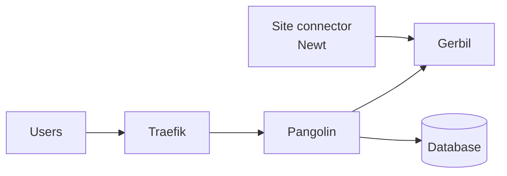

import PangolinCloudTocCta from "/snippets/pangolin-cloud-toc-cta.mdx";

<PangolinCloudTocCta />

## Components

| Component | Role |
| --- | --- |
| Pangolin | Main application for the dashboard, API, authentication, configuration, and database-backed state. |
| Gerbil | Tunnel stack component used by Pangolin for site connectivity. |
| Site (Newt) | Site connector used to connect private resources to Pangolin. |
| Traefik | Reverse proxy and router for ingress traffic. |
| PostgreSQL / SQLite | Database options for Pangolin deployments, depending on the selected chart configuration. |
| Pangolin Kube Controller | Kubernetes controller for integrating Pangolin with Kubernetes and Traefik resources. |

<Info>
Depending on your deployment mode, not every component is required. Local reverse proxy deployments and tunneled site deployments can have different component requirements.
</Info>

## Installation paths

<CardGroup cols={2}>
	<Card title="Choose an Installation Path" href="/self-host/manual/kubernetes/choose-method" icon="route">
		Pick the Kubernetes workflow that matches how you deploy applications.
	</Card>
	<Card title="Prerequisites" href="/self-host/manual/kubernetes/prerequisites" icon="list-check">
		Review the required cluster, ingress, DNS, storage, and secret setup.
	</Card>
	<Card title="Helm Quick-Start" href="/self-host/manual/kubernetes/helm" icon="box">
		Install Pangolin or Sites (Newt) with the standard chart-based workflow.
	</Card>
	<Card title="Kustomize Quick-Start" href="/self-host/manual/kubernetes/kustomize" icon="layer-group">
		Use overlays and patches for manifest-based deployments.
	</Card>
	<Card title="Argo CD Guide" href="/self-host/manual/kubernetes/gitops/argocd" icon="code-branch">
		Deploy Pangolin or Sites (Newt) with Argo CD.
	</Card>
	<Card title="Flux Guide" href="/self-host/manual/kubernetes/gitops/flux" icon="code-branch">
		Deploy Pangolin or Sites (Newt) with Flux.
	</Card>
	<Card title="Helmfile Guide" href="/self-host/manual/kubernetes/helmfile" icon="boxes-stacked">
		Manage multiple Helm releases together.
	</Card>
</CardGroup>

## Component guides

<CardGroup cols={2}>
	<Card title="Pangolin with Helm" href="/self-host/manual/kubernetes/pangolin/helm" icon="server">
		Install Pangolin with the Helm chart.
	</Card>
	<Card title="Pangolin Configuration" href="/self-host/manual/kubernetes/pangolin/configuration" icon="sliders">
		Configure Pangolin for your Kubernetes environment.
	</Card>
	<Card title="Pangolin Troubleshooting" href="/self-host/manual/kubernetes/pangolin/troubleshooting" icon="circle-question">
		Diagnose and resolve Pangolin deployment issues.
	</Card>
	<Card title="Site (Newt) Helm" href="/self-host/manual/kubernetes/newt/helm" icon="server">
		Install a Site connector with the Newt Helm chart.
	</Card>
	<Card title="Site (Newt) Configuration" href="/self-host/manual/kubernetes/newt/configuration" icon="sliders">
		Configure Site connector credentials and runtime settings.
	</Card>
	<Card title="Site (Newt) Troubleshooting" href="/self-host/manual/kubernetes/newt/troubleshooting" icon="circle-question">
		Diagnose and resolve Site connector deployment issues.
	</Card>
</CardGroup>
