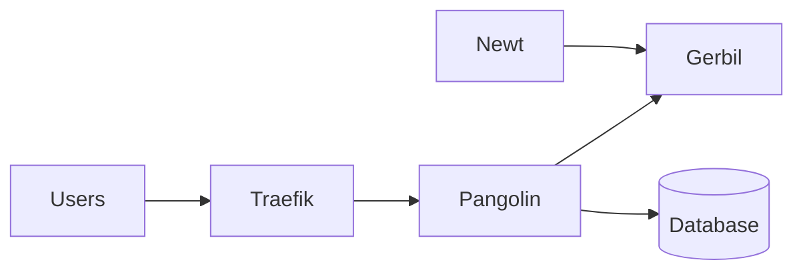

import PangolinCloudTocCta from "/snippets/pangolin-cloud-toc-cta.mdx";

<PangolinCloudTocCta />

## Kubernetes deployment options

Kubernetes is a good fit for running Pangolin-related components when you need repeatable deployments, workload isolation, rolling updates, and integration with existing cluster services such as ingress, storage, monitoring, and network policy.

This section covers the main Kubernetes workflows:

- **Helm** for the recommended chart-based installation and upgrade workflow.
- **Kustomize** for overlay-based customization and manifest-driven deployments.
- **GitOps** with Argo CD or Flux for reconciling Helm charts, Kustomize overlays, or manifests from Git.
- **Helmfile** for advanced setups that manage multiple Helm releases together.

## What this section covers

- Kubernetes prerequisites and cluster requirements.
- Installation workflows for Helm, Kustomize, GitOps, and Helmfile.
- Pangolin installation, configuration, and troubleshooting.
- Newt installation, configuration, and troubleshooting.
- How Pangolin, Gerbil, Traefik, Newt and Pangolin-Kube-Controller fit together in tunneled deployments.

## Components

| Component | Role |
| --- | --- |
| Pangolin | Main application and control plane for the dashboard, API, authentication, configuration, and database-backed state. |
| Gerbil | WireGuard interface management service used as part of the Pangolin tunnel stack. |
| Newt | Site connector used to expose private resources through Pangolin. Newt runs as a user-space WireGuard tunnel client and TCP/UDP proxy. |
| Traefik | Reverse proxy and router for ingress traffic. |
| PostgreSQL / SQLite | Database options for Pangolin deployments, depending on the selected installation workflow and chart configuration. |
| Controller | Kubernetes controller for integration with Traefik cluster resources, replacing single Traefik instances with Traefik ingress controllers. |

<Info>
For local reverse proxy deployments, the full tunnel stack may not be required. Tunneled sites require the components needed for Newt and WireGuard-based connectivity.
</Info>

## Method comparison

Choose the workflow that matches how you already manage Kubernetes applications:

| Method | Best for | Complexity | GitOps fit |
| --- | --- | --- | --- |
| **Helm** | Standard Kubernetes installs and upgrades | Low | Works with Argo CD and Flux |
| **Kustomize** | Environment-specific overlays and manifest customization | Medium | Works with Argo CD and Flux |
| **Argo CD** | Git-driven reconciliation with a web UI and sync status | Medium | Native GitOps workflow |
| **Flux** | Declarative GitOps using Kubernetes custom resources | Medium | Native GitOps workflow |
| **Helmfile** | Managing multiple Helm releases as one deployment stack | Medium | Usually used from CI/CD or a controlled automation workflow |

<Tip>
Argo CD and Flux are delivery and reconciliation tools. They do not replace Helm or Kustomize. They can deploy Helm charts, Kustomize overlays, and other Kubernetes manifests.
</Tip>

## Recommended starting points

<CardGroup cols={2}>
	<Card title="Choose a Method" href="/self-host/manual/kubernetes/choose-method" icon="code-branch">
		Compare Helm, Kustomize, GitOps, and Helmfile before choosing a workflow.
	</Card>
	<Card title="Prerequisites" href="/self-host/manual/kubernetes/prerequisites" icon="list-check">
		Review the cluster, ingress, storage, DNS, and tooling requirements.
	</Card>
	<Card title="Helm" href="/self-host/manual/kubernetes/helm" icon="layer-group">
		Start with the recommended chart-based Kubernetes workflow.
	</Card>
	<Card title="Kustomize" href="/self-host/manual/kubernetes/kustomize" icon="layer-group">
		Use overlays and patches for manifest-based deployments.
	</Card>
	<Card title="GitOps" href="/self-host/manual/kubernetes/gitops/overview" icon="code-branch">
		Deploy with Argo CD or Flux from Git.
	</Card>
	<Card title="Helmfile" href="/self-host/manual/kubernetes/helmfile" icon="scroll">
		Manage Pangolin, Newt, and supporting Helm releases together.
	</Card>
</CardGroup>

## Component quick links

<CardGroup cols={2}>
	<Card title="Pangolin with Helm" href="/self-host/manual/kubernetes/pangolin/helm" icon="server">
		Install Pangolin with the Helm chart.
	</Card>
	<Card title="Pangolin Configuration" href="/self-host/manual/kubernetes/pangolin/configuration" icon="sliders">
		Configure Pangolin for your Kubernetes environment.
	</Card>
	<Card title="Newt with Helm" href="/self-host/manual/kubernetes/newt/helm" icon="server">
		Install Newt in a Kubernetes cluster.
	</Card>
	<Card title="Newt Configuration" href="/self-host/manual/kubernetes/newt/configuration" icon="sliders">
		Configure Newt credentials, endpoints, resources, and runtime settings.
	</Card>
</CardGroup>
